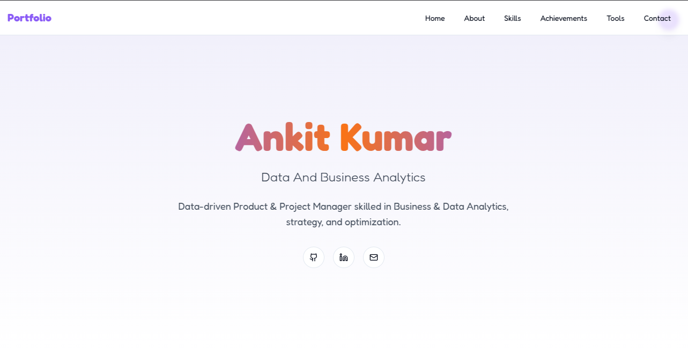

# Personal Portfolio Website



A modern, responsive portfolio website built with React, TypeScript, and Tailwind CSS, featuring a clean design and smooth animations.

## 🌟 Features

- **Responsive Design**: Seamlessly adapts to all screen sizes
- **Dark/Light Mode**: Toggle between color themes
- **Smooth Animations**: Engaging user experience with subtle animations
- **Interactive Components**: Dynamic UI elements using shadcn/ui
- **Modern Tech Stack**: Built with industry-standard technologies

## 🚀 Sections

- **Hero**: Eye-catching introduction with social links
- **About**: Professional background and downloadable resume
- **Skills**: Technical expertise categorized by domain
- **Achievements**: Interactive display of certifications
- **Tools**: Showcase of professional tools and technologies
- **Contact**: Multiple ways to get in touch

## 🛠️ Technologies Used

- **Frontend Framework**: React + TypeScript
- **Styling**: Tailwind CSS
- **UI Components**: shadcn/ui
- **Icons**: Lucide React
- **Animations**: Custom CSS animations
- **State Management**: React Hooks
- **Build Tool**: Vite

## 📦 Project Structure

```
src/
├── assets/          # Static assets (images, PDFs)
├── components/      # React components
│   ├── ui/         # Reusable UI components
│   ├── About.tsx   # About section
│   ├── Hero.tsx    # Hero section
│   └── ...         # Other section components
├── lib/            # Utility functions
├── pages/          # Page components
└── App.tsx         # Main application component
```

## 🎨 Features & Components

### Core Components
- **ThemeToggle**: Dynamic theme switching
- **Navbar**: Responsive navigation menu
- **Hero**: Animated introduction section
- **About**: Professional background with downloadable assets
- **Skills**: Interactive skill showcase
- **Achievements**: Certificate gallery
- **Contact**: Multiple contact options

### UI Components
- Custom buttons with hover effects
- Responsive cards with animations
- Interactive tooltips
- Toast notifications
- Modal dialogs
- Form elements

## 🚀 Getting Started

1. **Clone the repository**
```bash
git clone https://github.com/lakshay-goyal/ankit-portfolio
```

2. **Install dependencies**
```bash
npm install
```

3. **Start development server**
```bash
npm run dev
```

4. **Build for production**
```bash
npm run build
```

## 📱 Responsive Design

- Mobile-first approach
- Breakpoints for all device sizes
- Optimized layouts for different screens
- Touch-friendly interactions

## 🎨 Customization

### Theme Colors
The project uses a custom color palette defined in Tailwind config:
- Primary: Portfolio brand color
- Accent: Secondary brand color
- Background: Light/dark mode backgrounds
- Text: Optimized for readability

### Adding New Sections
1. Create new component in `src/components`
2. Add routing in `App.tsx`
3. Update navigation in `Navbar.tsx`

## 📧 Contact

For any questions or feedback, please reach out:
- Email: [ankitkrthakur881@gmail.com](mailto:ankitkrthakur881@gmail.com)
- LinkedIn: [Ankit Kumar](https://www.linkedin.com/in/ankit-kumar-293946319/)
- GitHub: [Ankit-Kumar2005](https://github.com/Ankit-Kumar2005)

---